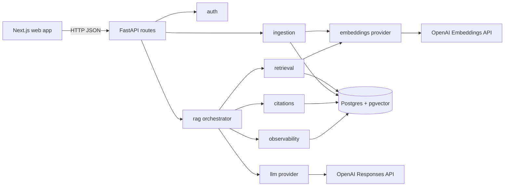
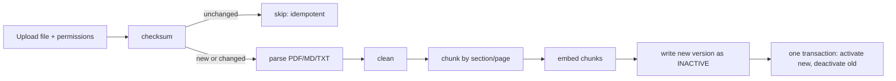
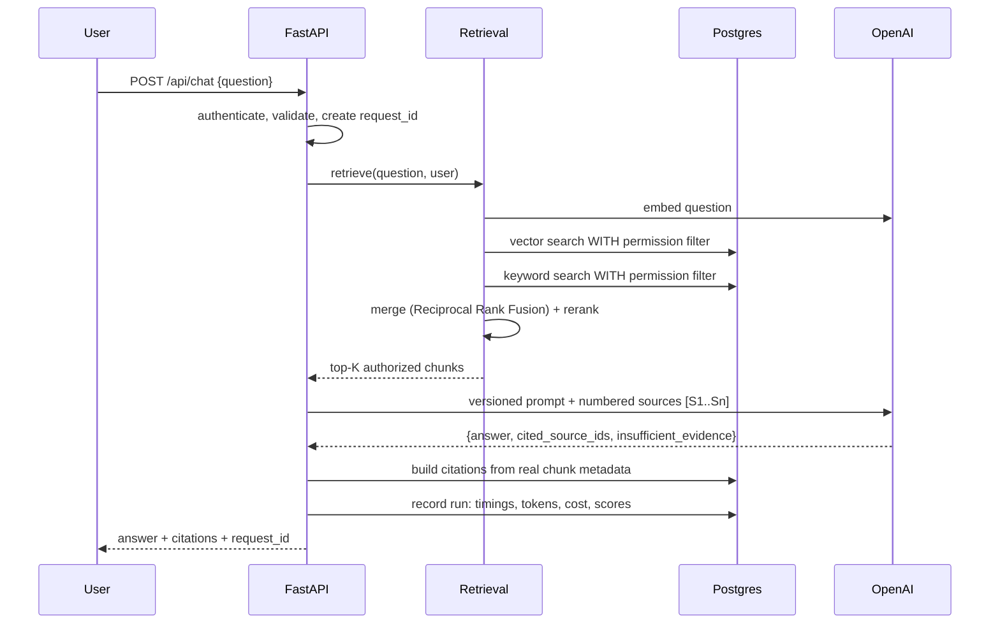

# Ignite RAG v1 — Architecture Overview

Status: Accepted (2026-09-26)

## 1. The big picture

Ignite is a *modular monolith*: one backend app (FastAPI) with clearly separated
modules, one database (Postgres + pgvector), one frontend (Next.js).
Modules talk through plain Python function calls, not network calls, so it is
easy to read, debug and learn from. Boundaries are kept clean so a module can
be extracted into its own service later if scale demands it.



## 2. Flow A — Ingesting a document (Phase 2)



Key rules:
- Each document is chunked on its own (never glued to other documents).
- Every chunk carries: document_id, version, page/section, source, permissions.
- Same file uploaded twice => same checksum => nothing happens (idempotent).
- If anything fails, the old version stays live and the job records the error.

## 3. Flow B — Answering a question (Phases 1, 3, 4, 5)



The most important security idea: **permission filtering happens inside the
database query**, so unauthorized text never reaches the LLM. The model cannot
leak what it never sees.

## 4. Backend modules (all inside `apps/api`)

| Module | Responsibility |
|---|---|
| routes | HTTP only; no business logic |
| auth | who is the user; what can they see (dev login switcher in v1) |
| ingestion | parse, clean, chunk, embed, publish versions |
| retrieval | vector + keyword search, fusion, reranking |
| rag | build bounded context, call LLM, enforce grounded answers |
| citations | turn cited source ids into real document metadata |
| evaluation | golden dataset runner + metrics |
| observability | request ids, stage timings, tokens, cost |
| llm / embeddings | provider interfaces + OpenAI implementation |
| repositories | all SQL / database access |

## 5. Data model

Tables from the spec, plus two additions (marked +):
users, departments, user_departments, documents, **+document_versions**,
document_permissions, chunks, ingestion_jobs, evaluation_cases, rag_runs,
retrieval_results, **+audit_log**.

## 6. Repository layout

```
ignite-ai/
  CLAUDE.md                 # project rules for every Claude session
  docker-compose.yml        # Postgres + pgvector
  .env.example
  apps/
    api/                    # FastAPI backend (uv project)
      app/{routes,auth,ingestion,retrieval,rag,citations,
           evaluation,observability,llm,repositories,models}
      migrations/           # Alembic
      tests/{unit,integration,evaluation}
    web/                    # Next.js frontend
  data/{sample-documents,eval}
  docs/{architecture,decisions,learning}
  .github/workflows/ci.yml
```

## 7. Where each thing runs (local dev)

| Thing | Runs on | Who starts it |
|---|---|---|
| Postgres + pgvector | Docker Desktop on your Mac | you: `docker compose up -d` |
| FastAPI | your Mac terminal | you: `uv run fastapi dev` |
| Next.js | your Mac terminal | you: `npm run dev` |
| Unit tests / linting | Claude's sandbox on your Mac, and your terminal | both |
| Integration tests (need DB) | your Mac terminal | you, and GitHub CI |

## 8. Decisions to record as ADRs

1. Modular monolith, single backend app.
2. Postgres + pgvector for both relational and vector data.
3. Permission filter inside SQL (pre-filter), 404 for unauthorized.
4. Postgres full-text search as "keyword" retrieval (not true BM25).
5. Reciprocal Rank Fusion to merge results.
6. LLM reranker first, measured against a local cross-encoder later.
7. Citations built by the backend from source ids, never model-written URLs.
8. Dev login switcher with seeded users instead of real SSO.
9. OpenAI behind provider interfaces; models set via env vars.
10. uv for Python, npm for Node, GitHub Actions CI from day 1.
